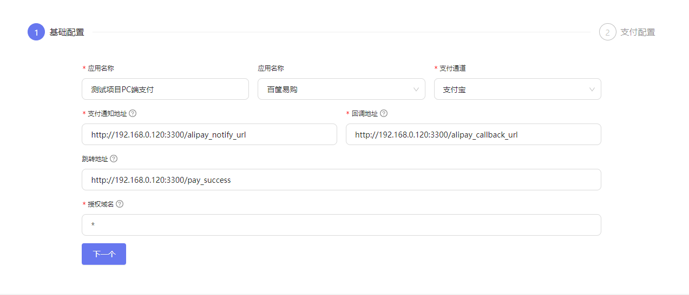
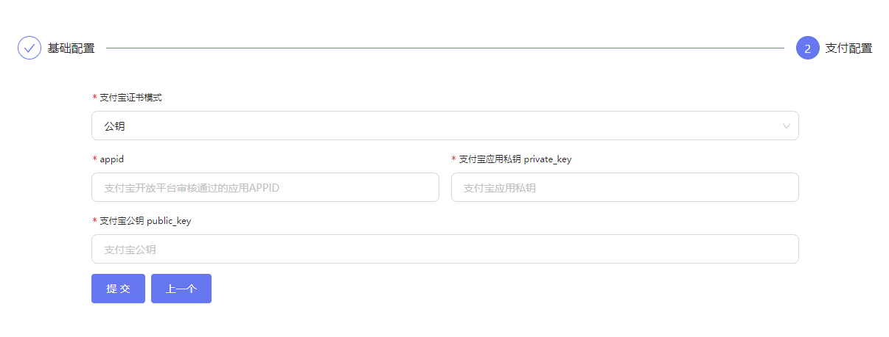
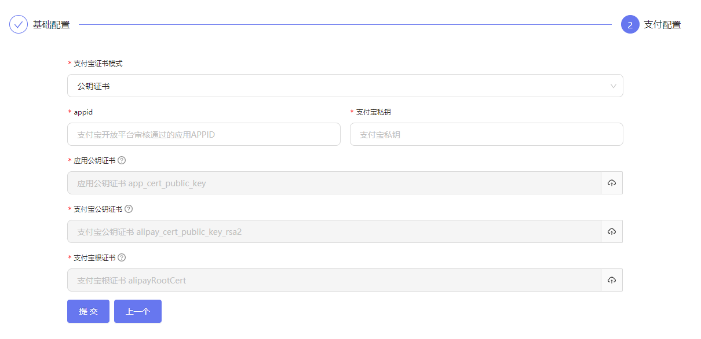
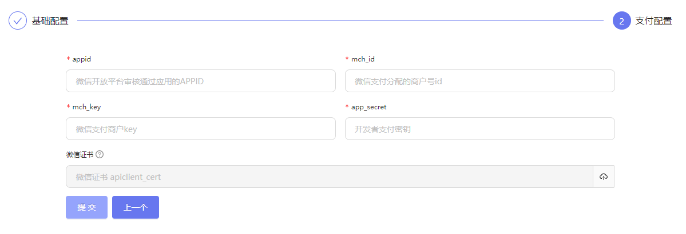
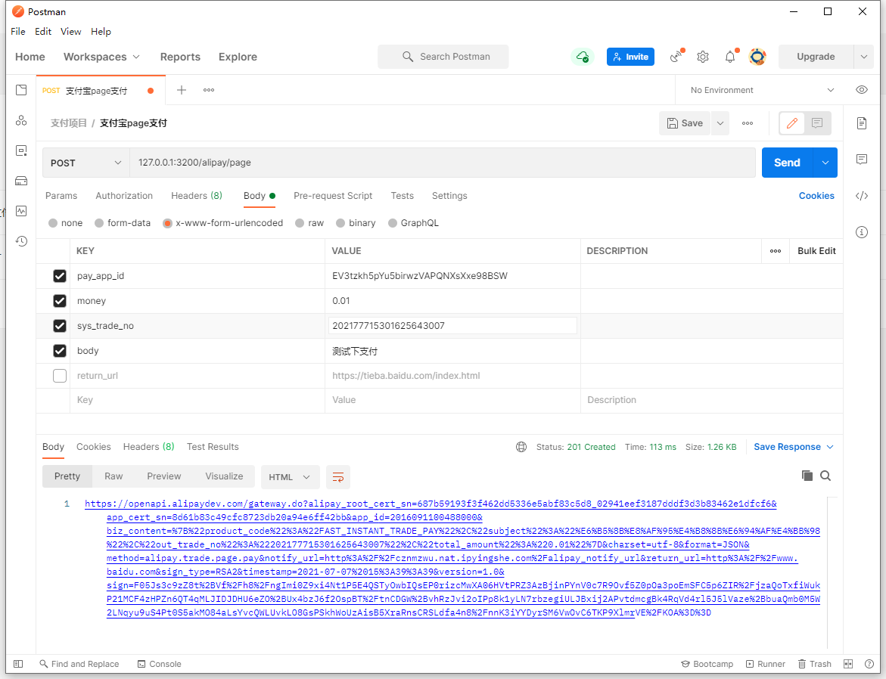

<p align="center">
  <a href="http://nestjs.com/" target="blank"></a>
</p>
  
  <p align="center">成功马一龙，失败贾老板！</p>
  <p align="left">
    鸣谢(不分前后)：
  </p>
  <p>左老板 <a href="https://github.com/notadd/nt-addon-pay" target="blank">nt-addon-pay</a> 省去编写微信支付的一些ts代码</p>
  <p>zoujingli <a href="https://github.com/zoujingli/WeChatDeveloper" target="blank">WeChatDeveloper</a> 很不错的php支付sdk！看了这位老哥代码，做支付宝支付的时候清晰很多!</p>
  <p>fym201 <a href="https://github.com/fym201/alipay-node-sdk" target="blank">WeChatDeveloper</a> 借用了一些代码~~</p>
  <p>weishour 提供的日志</p>

## tips 

1. 支付宝代码不会有太大的调整，支付宝还有几个接口没写。微信xml解析后期变动会比较大。等把微信的接口改完就开始编写接口文档。
2. 一个人开发精力有限，更新比较慢，bug可能比较多。也欢迎各位大佬提交代码。
3. 如果你有啥好的想法或者点子可以添加我的qq： 523431532（微信同号）


## 描述

一个nestjs编写的支付平台

<div align="center">
  
</div> 
<p align="center">支付流程介绍</p>

## 使用

```ts

git clone https://github.com/galaxy-softwares/galaxy-pay

cd galaxy-pay/galaxy-pay-admin

yarn && yarn start  // 启动前端 127.0.0.1:3000

cd galaxy-pay/galaxy-pay-api

yarn && yarn start:dev  // 启动后端API 127.0.0.1:3200

```

## 注意事项:

创建支付应用时有些需要注意的事项。

### 基础信息

<div align="center">
  
</div>

1. 支付通知地址有微信和支付宝两个通知url。

微信: 当前项目 + alipay_notify_url
支付宝: 当前项目 + wechat_notify_url

2. 回调地址 为支付完成后本系统接收到 微信/支付宝 异步通知后，将 订单号 与 内部交易号 发送至 "回调地址"。

```js
{
  out_trade_no: string,
  trade_no: string,
  sign: string
}

```

3. 创建支付应用的时候 如果是PC 支付 请务必将跳转地址填写，否则支付完成时，无法跳转回您的项目。

### 支付配置

支付宝分为公钥和公钥证书两种模式，配置上也有些不同。

#### 支付宝公钥

<div align="center">
  
</div>
<p  align="center">支付宝公钥</p>

公钥模式直接将支付宝给的参数复制上去即可。

#### 支付宝公钥证书

<div align="center">
  
</div>
<p  align="center">支付宝公钥证书</p>

支付宝公钥证书则根据每个 `Input` 提示上传证书即可


### 微信支付配置

<div align="center">
  
</div>
<p  align="center">微信支付配置</p>

微信证书则非必填，如果有打款退款操作时，则需要证书！

### 使用

当创建完成之后，即可直接使用。

<div align="center">
  
</div>

```js
请求参数

{
  pay_app_id: "EV3tzkh5pYu5birwzVAPQNXsXxe98BSW", // 系统随机分配
  money: '0.01',  // 支付金额
  sys_trade_no: '202177715301625643007', // 订单编号
  body:'测试支付'  // 支付正文
}

```
